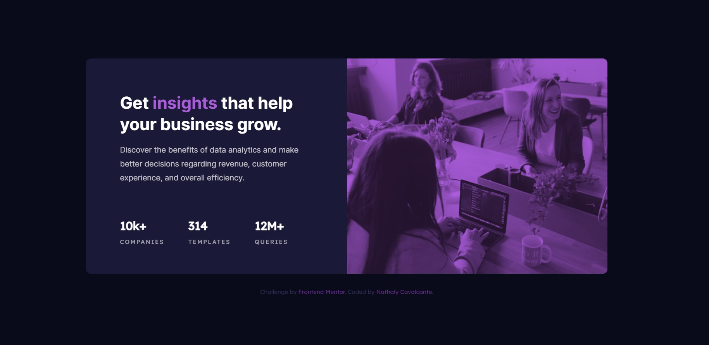

# Frontend Mentor - Stats preview card component solution

This is a solution to the [Stats preview card component challenge on Frontend Mentor](https://www.frontendmentor.io/challenges/stats-preview-card-component-8JqbgoU62). Frontend Mentor challenges help you improve your coding skills by building realistic projects. 


### The challenge

Users should be able to:

- View the optimal layout depending on their device's screen size

### Screenshot




## My process

### Built with

- HTML5
- CSS 
- Flexbox

### What I learned

mix-blend-mode in  CSS

To see how you can add code snippets, see below:


```css
.img-container img {
    max-width: 100%;
    height: 100%;
    opacity: 0.8;
    mix-blend-mode: multiply; 
}

.stats {
    display: flex;
    flex-direction: row;
    justify-content: flex-start;
    margin-top: 4.375rem;
}
```
